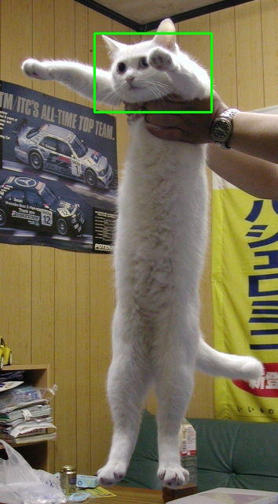

This program draws rectangles and circles accordingly to mouse events: Hold left mouse button to trigger and draw
## Demo pictures
- Keyboard funtions:
    + 'ESC': destroy windows
    + 'm': change mode: rectangle -> circle 
    + 'r': clear, and reset window to original image
    + 's': save annotated image to 'annotatedimg.jpg' 
- Output: 
    

    